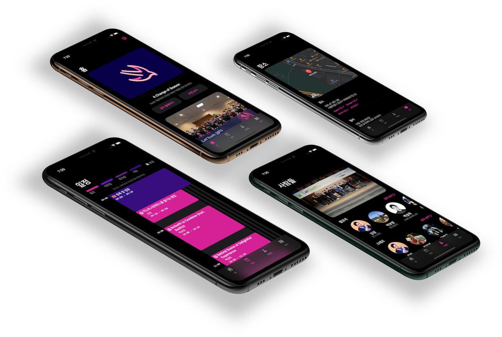

# 구범모의 이력서

저는 Objective-C로 3년, Swift로 6년간 iOS, iPadOS, watchOS, macOS 등 여러 Apple의 플랫폼에서 개발을 해왔습니다. 2012년 학생일 때부터 iOS 개발을 시작해 지금까지 여러 회사와 스타트업에서 경험을 쌓았습니다.

중국 대련에서 9년을 살고 국제학교를 3년 다녀 한국어, 영어, 중국어를 모두 편하게 사용합니다.

저는 각종 애플 뉴스와 최신 애플 기술을 확인하는 것을 즐깁니다. 얻은 정보로 새로운 것을 만들어 그 경험을 공유하는 것을 좋아해 9개의 iOS 개발자 컨퍼런스에서 발표를 진행했습니다. 저는 항상 Apple이 제공하는 유려한 사용자 인터페이스와 사려 깊은 API 디자인에 영감을 얻습니다.

## 경력 및 경험
### Apple WWDC20 Swift Student Challenge 선정

윷놀이, _2020_, [GitHub](https://github.com/gbmksquare/WWDC-2020)

WWDC20 Swift Student Challenge에 제출 및 선정된 Swift Playground로, 한국의 전통 놀이인 윷놀이를 소개합니다. 처음 써보는 `SceneKit`을 사용해 일주일 동안 빠르게 만들어졌습니다. 3D 에셋도 Blender를 사용해 직접 제작했습니다.

### 네이버 웹툰

iOS 개발자 (인턴) | _2019.01 - 2019.02_

* 7인 팀에서 _시리즈온_ 앱 UI 및 기능 개편 프로젝트 참여.
* 기존 코드베이스에서 버그 발견 및 수정, 성능 향상.

 
\pagebreak 

### VREX Lab

iOS 개발자 | _2017.02 - 2017.12_ㅎ

* 위치 기반 SNS 앱 `Rush` (국제 버전) 및 `Tiele` (중국 버전) 개발.
* 서버 및 클라이언트 개발자와 다중언어 환경에서 원격 작업.

* 현지 및 국제 버전 배포를 위한 멀티 스킴, 멀티 타겟 개발 환경 구축.

* Fastlane을 사용한 자동 빌드 및 배포 시스템 구축.

### MWSTORY

iOS 개발자 | _2014.04 - 2016.06_

* Objective-C 기반 SK Planet용 내부 푸시 알림 SDK 개발.
* 증명사진 편집 앱 `Self Shot` 및 투자 앱  `Yink` 개발.

### 프리랜서

iOS 개발자 | _2013.01 - 2020.07_

iOS 개발 프리랜서로 일하면서 iOS, iPadOS 및 macOS 앱을 만들었으며 오디오, 비디오, 3D 에셋, 써드파티 SDK 등 다양한 기능을 구현했습니다. 다양한 프로젝트에 일하면서 레거시 코드베이스에 얽매이지 않고 여러 코딩 스타일과 API를 적용해볼 수 있었습니다.

_작업한 일부 프로젝트 목록입니다._

* __Potentiostat__, 연구용 데이터 정리 및 그래프를 위한 내부 iPadOS 앱, _2019_
* __Field Management System__, 기업용 앱 버그 수정 및 유지 보수, _2019_
* __Real World__, 현실판 방 탈출 게임 iOS 앱, _2018_
* __Mystery Trail__, 역시 현실판 방 탈출 게임 iOS 앱, _2018_
* __Bahn__, 현실 속 미스터리를 해결하는 전시용 앱, _2018_
* __LeapMotion Data Collector__, Leap Motion SDK를 사용해 손가락 움직임 데이터를 수집하는 내부 연규용 OS X 앱, _2016 - 2018_
* __Qplace__, 맛집 큐레이션을 위한 `UIWebView` 래퍼 앱, _2013 - 2014_

 
\pagebreak 

### 교육

* __고려대학교__, 학사, 정보대학 컴퓨터학과, _2012 - 2020_
* __고려대학교__, 학사, 디자인조형학부 산업정보디자인 (이중 전공), _2013 - 2019_

### 기타

* __네이버 캠퍼스 핵데이 우수 참가자__, 증강현실 톺아보기 with ARKit, _2018_
* __Microsoft Student Partners__, 에반젤리스트 (Microsoft Cognitive Service), _2016.09 - 2017.07_

## 개인 프로젝트

_⚠️ 일부 프로젝트만 공개되어 있습니다._

__kuStudy__

고려대학교 열람실 현황 유틸리티 앱

_2014 - 현재_, [App Store](https://apps.apple.com/app/id925255895), [GitHub](https://github.com/gbmksquare/kuStudy)

이 앱은 제 iOS 개발 경력을 함께 해온 앱으로 다양한 실험과 새로운 API 적용을 해본 앱입니다. iOS, iPadOS, wacthOS, 오늘 위젯을 지원할 뿐만 아니라 여러  여러 손쉬운 사용, 하드웨어 키보드 및 트랙패드 등을 지원하며 Objective-C부터 모든 버전의 Swift를 거쳤습니다. 최근에는 CocoapPods에서 Swift Package Manager로 이주하며 iOS 14의 새로운 API 도입 예정입니다.

 
\pagebreak 

__Let'Swift__

_2019_, [App Store](https://apps.apple.com/app/id1282995254), [GitHub](https://github.com/cleanios/LetSwift)

Let'Swift는 SwiftUI가 갓 출시했을 때 만들어진 합작품입니다. 참고 자료가 부족했던 시절 SwiftUI만을 사용해 삽질을 하며 만들어진 유니버설 앱이며 서울에서 열리는 Let'Swift 컨퍼런스를 위해 탄생했습니다.

__기타__

* __Dice__, 첫 Apple Watch의 발매에 맞춰 만든 간단한 주사위 앱, _2015 - 현재_, [App Store](https://apps.apple.com/app/id989101771)
* __Smart Express Terminal__,  `RealityKit`과 Reality Composer를 사용한 고려대학교 산업정보디자인 졸업전시를 위한 AR 앱, _2019_
* [App Store에 있는 범모의 앱](https://apps.apple.com/developer/bummo-koo/id918897632)

## 발표

_⚠️ 일부 링크는 웹사이트가 더 이상 존재하지 않을 수 있습니다._

let us: Go!와 Swift Korea Meetup은 서울에서 개최되는 iOS 개발자 커뮤니티 컨퍼런스입니다._

__스토리보드 없이 UI 만들기__ | let us: Go!, _2019.03.30_

> Storyboard와 XIB을 사용했을 때와 코드만 사용해 UI을 만들 때의 경우를 비교해봅니다.
>

 
\pagebreak 

__단축어와 놀기__ | let us: Go!, _2018.10.20_

> Apple의 새로운 단축어 앱을 활용해 다양한 것을 해봅니다.
>

__미리 보는 Marzipan__ | let us: Go!, _2018.07.21_

> Apple의 iOS 앱을 macOS로 포팅하는 Catalyst 프로젝트로 이어지는 Marzipan에 대해 알아봅니다.
>

__Haptic Feedback으로 시작하는 iOS 개발의 이모저모__ | let us: Go!, _2018.03.10_

> 쉽게 지나칠 수 있지만 사용자 경험에 기여하는 작은 디테일을 알아봅니다.
>

__iOS 앱의 접근성 향상하기__ | let us: Go!, _2017.11.04_

>  iOS 앱의 접근성을 향상할 수 있는 방법을 알아봅니다.
>

__iOS 소스 코드로 UWP(유니버설 윈도우 플랫폼) 앱 만들기__ | let us: Go!, _2017.06.24_

> Microsoft의 WinObjC 프로젝트를 사용해 iOS 소스코드로 Universal Windows Platform 앱을 만들어봅니다.
>

__Playground 100% 활용하기__ | Swift Korea Meetup, _2017.04.28_

> Apple의 새로운 iPad Playground 앱을 활용해봅니다.
>

__Introduction to Fastlane__ | let us: Go!, _2017.04.01_

> Fastlane 도구를 사용해 iOS 앱의 배포를 자동화 하는 법을 알아봅니다..
>

__Fastlane Snapshot으로 배포용 스크린샷 자동으로 만들기__ | iOS Tech Talk, _2017.02.15_

> iTunes Connect에 올리는 스크린샷을 자동으로 캡쳐하는 방법을 알아봅니다.
>

## 취미 및 활동

* 여가 시간에 예쁜 자연경관을 사진으로 담는 게 취미입니다.
* 최근에는 Blender로 모델링 및 렌더링하는 법을 배우고 있습니다.
* 레이저 커터와 3D 프린터를 쓸 줄 알고 티렉스 뼈대를 3D 프린팅해본 경험이 있습니다.
* 영화를 보고, 가끔 마인크래프트나 스타 2를 하는 것을 좋아하고 비행기 모형을 수집합니다.
* 포토샵, 일러스트레이터, 라이트룸 등 2D 편집 프로그램을 다룰 줄 알고 Final Cut Pro, Blender, SketchUp도 사용합니다.

## 연락처

__Email__: ksquareatm@gmail.com

__GitHub__: https://github.com/gbmksquare

__LinkedIn__: https://www.linkedin.com/in/gbmksquare

__Twitter__: [https://twitter.com/gbmKSquare](https://twitter.com/gbmKSquare)

__Facebook__: [https://www.facebook.com/gbmksquare](https://www.facebook.com/gbmksquare)

__Instagram__: [https://www.instagram.com/gbmksquare](https://www.instagram.com/gbmksquare)

<!-- 비밀 메시지를 찾으셨네요! 관심과 정성에 박수를 드립니다. 👻-->