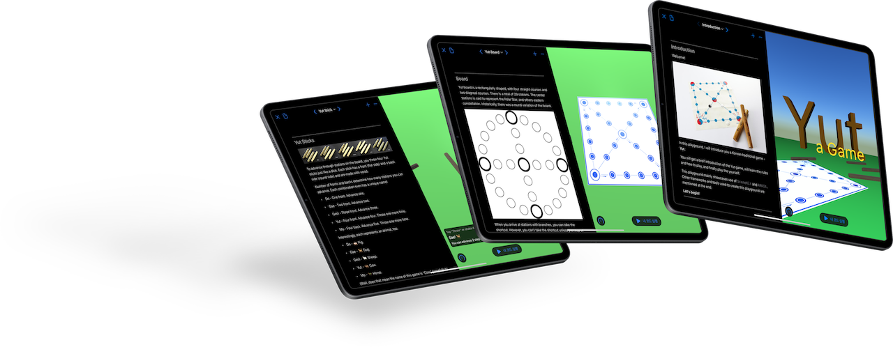
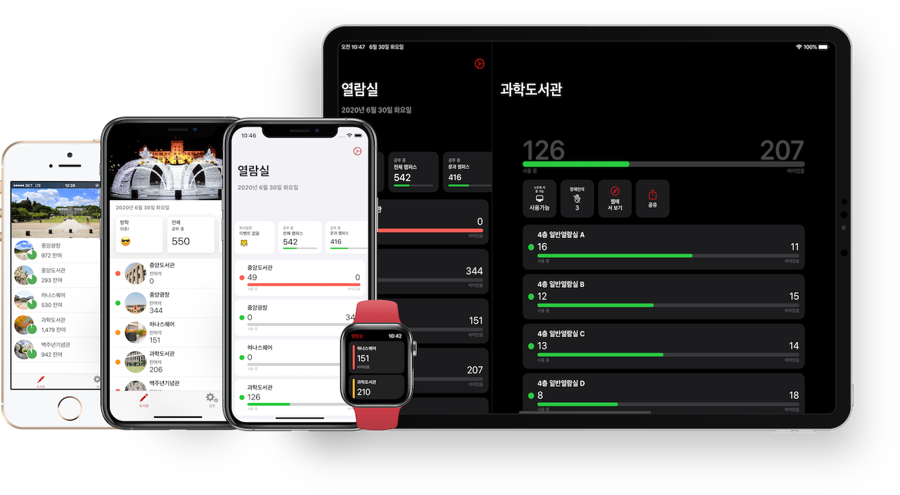
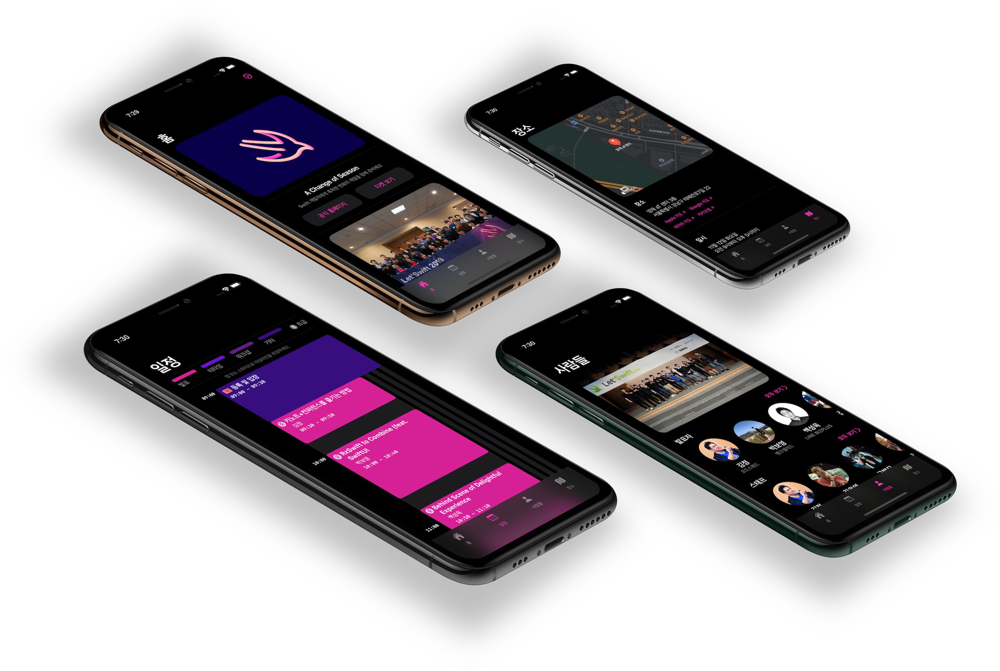

# BumMo Koo's Resumé

I have 3 years of experience in Objective-C and 6 years of experience in Swift language, and made apps on most of Apple's platform, such as iOS, iPadOS, watchOS, and macOS. I've been developing iOS apps since 2012 when I was still a student, and have worked on multiple startups and big companies ever since.

Having lived in Dalian, China for 9 years and currently living in Seoul, Korea, I speak Korean, English, and Chinese.

I arduously follow Apple news and lastest Apple technology. I like experimenting with new information, and share what I learned and experienced and have presented in 9 iOS conferences. I am always inspired by the elegance of user interface and delicacy of API designs by Apple.

## Experience

### Apple WWDC20 Swift Student Challenge Winner

Yut - a Game, _2020_, [GitHub](https://github.com/gbmksquare/WWDC-2020)

I've been chosen as one of the WWDC20 Swift Student Challenge winner by making a Swift Playground that introduces Yut, a traditional Korean game. This is a week-long project using `SceneKit` to teach and play Yut. This was the first time I used `SceneKit` , and I made all 3D assets myself using Blender.

 
\pagebreak 

### Naver Webtoon

iOS Developer Intern | _2019.01 - 2019.02_

* Participated in UI and feature overhaul project for VOD service _Series On_ in a 7 member team.
* Discovered and fixed bugs, and made performance improvements on old codebase.

### VREX Lab

iOS Developer | _2017.02 - 2017.12_

* Created a location-based SNS app Rush (Global version) and Tiele (Chinese version).
* Remotely cooperated with server and client developers in China on multilingual environment.
* Built a multi-scheme, multi-target app environment with different sets of SDKs and configurations for internalization.
* Configured an automatic build and release system using Fastlane.

### MWSTORY

iOS Developer | _2014.04 - 2016.06_

* Designed and architected an Objective-C based internal push notification SDK for SK Planet.
* Also built photo ID editing app _Self Shot_ and investment app _Yink_. 

### Freelancer

iOS Developer | _2013.01 - 2020.07_

I worked on iOS, iPadOS, and macOS projects, mostly iOS, that utilized features such as audio, video, 3D scenes, charts, third-part SDKs and more. These projects allowed me to experience a variety of SDKs and challenged me to adopt newer APIs and coding styles without lingering on legacy codebase.

_Here are some of the projects I worked on:_

* __Potentiostat__, an internal iPadOS app to organize and present potentiostat data for research, _2019_
* __Field Management System__, bug fixes and maintenance of an enterprise iOS app, _2019_
* __Real World__, an real life room-escape style iOS app, _2018_
* __Mystery Trail__, also a real life room-escape style iOS  app, _2018_
* __Bahn__, an real life mystery-solving iOS  app used in an exhibition, _2018_
* __LeapMotion Data Collector__, an internal OS X app using Leap Motion SDK to gather finger motion tracking data for research , _2016 - 2018_
* __Qplace__, a `UIWebView` wrapper app for restaurant curation, _2013 - 2014_

### Education

* __Korea University__, Bachelor's Degree, Computer Science & Engineering, _2012 - 2020_
* __Korea University__, Bachelor's Degree, Industrial & Product Design (Secondary major), _2013 - 2019_

### Others

* __Microsoft Student Partners__, Evangelist on Microsoft Cognitive Service, _2016.09 - 2017.07_

## Personal Projects

_⚠️ Not all project I worked on are listed._

__kuStudy__

A simple utility app showing availability of study area in Korea University.

_2014 - present_, [App Store](https://apps.apple.com/app/id925255895), [Open Sourced on GitHub](https://github.com/gbmksquare/kuStudy)

This app is an accumulation of what I've learned throughout my career. Supporting iOS, Today widget, iPadOS, and watchOS, it is packed with features such as accessibility, hardware keyboard shortcuts, trackpad support, and gone through multiple overhaul from Objective-C to all versions of Swift, and from CocoaPods to Swift Package Manager for dependency management.

__Let'Swift__

_2019_, [App Store](https://apps.apple.com/app/id1282995254), [GitHub](https://github.com/cleanios/LetSwift)

Let'Swift is a collaboration to build an app with newly-released SwiftUI. one the first apps on the App Store to be fully written in SwiftUI, this universal iOS app accompanies Let'Swift conference held in Seoul, Korea.

__More__

* __Dice__, just a simple dice app made for the launch of original Apple Watch, _2015 - present_, [App Store](https://apps.apple.com/app/id989101771)
* __Smart Express Terminal__, an AR app for Korea University School of Art & Design Graduation Exhibition using `RealityKit` and Reality Composer, _2019_
* [BumMo's Apps on App Store](https://apps.apple.com/developer/bummo-koo/id918897632)

 
\pagebreak 

## Speaking

_⚠️ Some links may be invalid due to original website no longer available._

_let us: Go! and Swift Korea Meetup are both iOS developer community conference held in Seoul, Korea._

__Making UI without Storyboards__ | let us: Go!, _2019.03.30_

> Let's compare what it's like to build UI with Storyboards and XIBs and with just code.
>
> [Conference](https://iosdevkor.github.io/let_us_go_2019_spring/) | [Conference Retrospect](https://iosdevkor.github.io/let_us_go_2019_spring_review/) | [Video](https://www.youtube.com/watch?v=-QWm9r4BzMI&feature=emb_title)

__Playing with Shortcuts__ | let us: Go!, _2018.10.20_

> Make the most out of Apple's new Shortcuts app.
>
> [Conference](https://iosdevkor.github.io/let_us_go_2018_fall/) | [Conference Retrospect](https://iosdevkor.github.io/let_us_go_2018_fall_review/) | [Video](https://www.youtube.com/watch?v=yEH6gwWJ8fY&feature=emb_title)

__A Preview of Marzipan__ | let us: Go!, _2018.07.21_

> Let's learn about code name Marzipan, Apple's attempt to introduce iOS apps to macOS, also a precursor to the Catalyst Project.
>
> [Conference](https://iosdevkor.github.io/let_us_go_2018_summer/) | [Conference Retrospect](https://iosdevkor.github.io/let_us_go_2018_summer_review/) | [Video](https://www.youtube.com/watch?v=egZ_kPa7MzE)

__Small Things in iOS Development__ | let us: Go!, _2018.03.10_

> Learn the small details about iOS apps, easy to miss, but essential experience of everyday use.
>
> [Conference](https://festa.io/events/8) | [Conference Retrospect](https://iosdevkor.github.io/let_us_go_2018_spring_review/) | [Video](https://www.youtube.com/watch?v=wouM0cQKx_w&feature=emb_title)

__Improving Accessibility of an iOS App__ | let us: Go!, _2017.11.04_

>  Accessibility is always very important. Let's earn to improve the accessibility of iOS application.
>
>  [Conference](https://onoffmix.com/event/114320) | [Conference Retrospect](https://iosdevkor.github.io/let_us_go_2017_fall_review/) | [Video](https://www.youtube.com/watch?v=A80LVHABk-k&feature=youtu.be)

__Creating a Universal Windows Platform App from iOS Source Code__ | let us: Go!, _2017.06.24_

> Using Microsoft's WinObjC project, we can make Universal Windows Platform app from iOS source code.
>
> [Conference](https://iosdevkor.github.io/let_us_go_2017_summer/) | [Conference Retrospect](https://iosdevkor.github.io/let_us_go_2017_summer_review) | ~~[Video](https://news.realm.io/kr/news/ios-uwp-app/)~~

__Make Full Use of Swift Playground__ | Swift Korea Meetup, _2017.04.28_

> Make the most out of Apple's new iPad Playground app.
>
> [Conference](http://onoffmix.com/event/96420) | [Conference](https://swiftkorea.github.io/meetup/) | ~~[Video](https://news.realm.io/kr/news/swift-playground/)~~

__Introduction to Fastlane__ | let us: Go!, _2017.04.01_

> Learn about Fastlane and its tools to automate release of an iOS app.
>
> [Conference](https://iosdevkor.github.io/let_us_go_2017_spring/) | [Conference Retrospect](https://iosdevkor.github.io/let_us_go_2017_spring_review/) | ~~[Video](https://news.realm.io/kr/news/ios-fastlane-demos)~~

__Making Screenshots for Release using Fastlane Snapshot__ | iOS Tech Talk, _2017.02.15_

> Learn how to automate taking screenshots of apps for iTunes Connect.
>
> [Conference](http://onoffmix.com/event/89695) | ~~[Video](https://news.realm.io/kr/news/automate-ios-screenshots-with-fastlane-snapshot/)~~

## Other Interests & Activities

* I like adventuring into beautiful landscapes and take photos in my spare time.
* Recently, I am learning to model and render things in Blender for fun.
* I know how to use a 3D printer and a laser cutter, and once 3D-printed a full set of T-rex skeletons.
* I like watching movies, sometimes play Minecraft and Starcraft II, and buy airplane models.
* I have basic skills in Photoshop, Illustrator, Lightroom and other 2D editing softwares, and also Final Cut Pro, Blender, and SketchUp.

## Contact
__Email__: ksquareatm@gmail.com

__GitHub__: https://github.com/gbmksquare

__LinkedIn__: https://www.linkedin.com/in/gbmksquare
