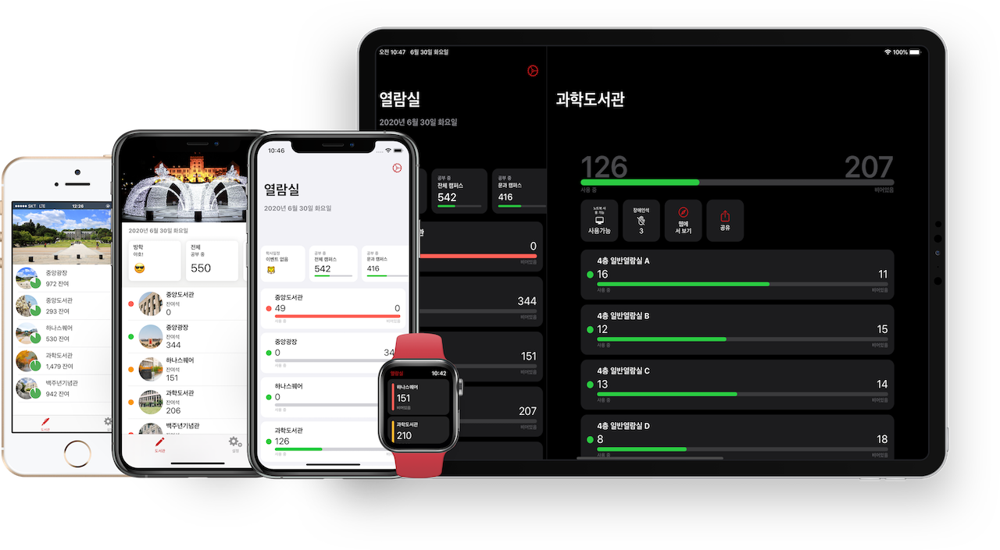

# BumMo Koo's Resumé

_Last updated on June 30, 2020_

[Available in Korean / 한국어 버전](./README-KR.md)

<!---->

My name is BumMo Koo. I lived in Dalian, China for 9 years, and currently live in Seoul, Korea. I've been developing iOS apps since 2012 when I was still a student and have worked on multiple startups and big companies developing for iOS ecosystem ever since. I like elegant and brilliant interface designs and enjoy working to create beautiful apps to life. Every iOS related videos, snippets,  small talks inspire me. I'm closely follow Apple related news, learn new things, and like to share them.

## Contact

You can find me at:

__Email__: ksquareatm@gmail.com

__GitHub__: https://github.com/gbmksquare

__LinkedIn__: https://www.linkedin.com/in/gbmksquare

## Contents

* [Skills & Competences](#Skills--Competences)

* [Experience](#Experience)
* [Projects](#Personal-Projects)
* [Open Source](#Open-Source)
* [Speaking](#Speaking)
* [Other Interests & Activities](#Other-Interests--Activities)

## Skills & Competences

I speak Korean, English, and Chinese.

I have 3 years of experience in Objective-C and 6 years of experience in Swift language, and made apps on most of Apple's platform, such as iOS, iPadOS, watchOS, and macOS.

I have basic skills in Photoshop, Illustrator, Lightroom and other 2D editing softwares, and also Final Cut Pro, Blender, and SketchUp.

## Experience

### Naver Webtoon

iOS Developer Intern | _2019.01 - 2019.02_

During two month period as an intern, I worked on _Series On_ app, a VOD service providing movies and dramas for purchase or rent, in a 7 member team. I participated in UI and feature overhaul project, recreating various views in Swift 4, and fixing some bugs from previous versions. It was collaboration of multiple team members closely working on a project utilizing GitHub enterprise.

### VREX Lab

iOS Developer | _2017.02 - 2017.12_

I workd on a location-based SNS app called Rush (Global ver) and Tiele (Chinese ver), remotely cooperating with server developer (Korean, located in China) and Android developer (Chinese, located in China). Developer in Swift 3, Rush / Tiele used multiple SDKs for similar features due to China / Global differeneces and restirctions, adopting `CoreLocation`, APNS, Baidu Push, Google Places, Google Maps, Amap API and also utilizing Xcode multi scheme and target, Fastlane distruction, etc.

### MWSTORY

iOS Developer | _2014.04 - 2016.06_

I worked as iOS developer for alternate military service, and mainly worked on an internal push notification SDK for SK Planet. It is a static Objective-C framework wrapping APNS and some internal APIs, using `NSOperationQueue`  and `NSNotification` for operation handling. I also worked on other iOS apps such as `Self Shot` app for ID photo editing, and `Yink` app for investment.

### Freelancer

iOS Developer | _2013.01 - 2020.07_

As an freelancing iOS developer, I workd on variety of apps ranging from simple `UIWebView` or `WKWebView` wrapper apps to fully-featured life style apps and research & utilities app using audio, video, 3D scenes, charts, third-part SDKs and more.

_See what I workd on in the Projects section._

__More__

* __Apple WWDC20 Swift Student Challenge Winner__, Yut - a Game, _2020_
* __Microsoft Student Partners__, Avangelist on Microsoft Cognitive Service, _2016.09 - 2017.07_

__Education__

* __Korea University__, Bachelor's Degree, Computer Science & Engineering, _2012 - 2020_
* __Korea University__, Bachelor's Degree, Industrial & Product Design (Secondary major), _2013 - 2019_

## Personal Projects

_⚠️ Not all project I worked on are listed._

__kuStudy__

_2014 - present_, [App Store](https://apps.apple.com/app/id925255895), [GitHub](https://github.com/gbmksquare/kuStudy)

A simple utility app showing remaining seats of study area in Korea University, kuStudy is an accumulation of what I have learned throughout my iOS career. Started with Objecive-C, it has gone through all versions of Swift, has support for iOS, Today widget, iPadOS, watchOS and got multiple redesigns. It also supports various accessibility features, hardware keyboard shortcuts and recently got support for trackpad cursor and migrated from CocoaPods to Swift Package Manager.

__Let'Swift__

_2019_, [App Store](https://apps.apple.com/app/id1282995254), [GitHub](https://github.com/cleanios/LetSwift)

Let'Swift is a open source collaboration of four people learning new-released SwiftUI. It is one the first apps on the App Store to be fully written in SwiftUI. It is an universal iOS app to accompany Let'Swift conference held in Seoul, Korea.

__Yut__

_2020_, [GitHub](https://github.com/gbmksquare/WWDC-2020)

A WWDC20 Swift Student Challenge submission and winner, this Swift Playground file introduces Yut, a traditional Korean game. It is a week-long rushed project mainly using `SceneKit` to present a game. This is also the first time I'm using `SceneKit` in a project. 3D assets are also self-made using Blender.

__More__

* __Dice__, just a simple dice app made for the launch of original Apple Watch, _2015 - present_, [App Store](https://apps.apple.com/app/id989101771)
* __Smart Express Terminal__, an AR app for Korea University School of Art & Design Graduation Exhibition using `RealityKit` and Reality Composer, _2019_
* [BumMo's Apps on App Store](https://apps.apple.com/developer/bummo-koo/id918897632)

__Freelance Projects__

* __Potentiostat__, an internal iPadOS app to organize and present potentiostat data, _2019_
* __Field Management System__, bug fixes and maintenance of an enterprise iOS app, _2019_
* __Real World__, an real life room-escape style iOS app, _2018_
* __Mystery Trail__, also a real life room-escape style iOS  app, _2018_
* __Bahn__, an real life mystery-solving iOS  app used in an exhibition, _2018_
* __LeapMotion Data Collector__, an internal OS X app using Leap Motion SDK to gather finger motion tracking data for research purpose , _2016 - 2018_
* __Qplace__, a `UIWebView` wrapper app for restaurant curation, _2013 - 2014_

## Open Source

### Applications

| Name      | Description                                                  | Link                                              |
| --------- | ------------------------------------------------------------ | ------------------------------------------------- |
| kuStudy   | Providing study area information of Korea University, this app supports iOS, iPadOS, watchOS, and has gone through transformation from Objective-C to all versions of Swift. | [GitHub](https://github.com/gbmksquare/kuStudy)   |
| Let'Swift | Made to accompany Let'Swift conference, it's an universal iOS app made entirely in SwiftUI. | [GitHub](https://github.com/cleanios/LetSwift)    |
| Yut       | A WWDC20 Swift Student Challenge submission and winner, this playground introduces Yut, a traditional Korean game. | [GitHub](https://github.com/gbmksquare/WWDC-2020) |

<!-- Libraries -->

## Speaking

_⚠️ Some links may be invalid due to original website no longer available._

__Making UI without Storyboards__ | let us: Go!, _2019.03.30_

> Let's compare what it's like to build UI with Storyboards and XIBs and with just code.
>
> [Conference](https://iosdevkor.github.io/let_us_go_2019_spring/) | [Conference Retrospect](https://iosdevkor.github.io/let_us_go_2019_spring_review/) | [Video](https://www.youtube.com/watch?v=-QWm9r4BzMI&feature=emb_title)

__Playing with Shortcuts__ | let us: Go!, _2018.10.20_

> Make the most out of Apple's new Shortcuts app.
>
> [Conference](https://iosdevkor.github.io/let_us_go_2018_fall/) | [Conference Retrospect](https://iosdevkor.github.io/let_us_go_2018_fall_review/) | [Video](https://www.youtube.com/watch?v=yEH6gwWJ8fY&feature=emb_title)

__A Preview of Marzipan__ | let us: Go!, _2018.07.21_

> Let's learn about code name Marzipan, Apple's attempt to introduce iOS apps to macOS, also a precursor to the Catalyst Project.
>
> [Conference](https://iosdevkor.github.io/let_us_go_2018_summer/) | [Conference Retrospect](https://iosdevkor.github.io/let_us_go_2018_summer_review/) | [Video](https://www.youtube.com/watch?v=egZ_kPa7MzE)

__Small Things in iOS Development__ | let us: Go!, _2018.03.10_

> Learn the small details about iOS apps, easy to miss, but essential experience of everyday use.
>
> [Conference](https://festa.io/events/8) | [Conference Retrospect](https://iosdevkor.github.io/let_us_go_2018_spring_review/) | [Video](https://www.youtube.com/watch?v=wouM0cQKx_w&feature=emb_title)

__Improving Accessibiltiy of an iOS App__ | let us: Go!, _2017.11.04_

>  Accessibility is always very important. Let's earn to improve the accessibility of iOS application.
>
> [Conference](https://onoffmix.com/event/114320) | [Conference Retrospect](https://iosdevkor.github.io/let_us_go_2017_fall_review/) | [Video](https://www.youtube.com/watch?v=A80LVHABk-k&feature=youtu.be)

__Creating an Universal Windows Platform App from iOS Source Code__ | let us: Go!, _2017.06.24_

> Using Microsoft's WinObjC project, we can make Universal Windows Platform app from iOS source code.
>
> [Conference](https://iosdevkor.github.io/let_us_go_2017_summer/) | [Conference Retrospect](https://iosdevkor.github.io/let_us_go_2017_summer_review) | ~~[Video](https://news.realm.io/kr/news/ios-uwp-app/)~~

__Make Full Use of Swift Playground__ | Swift Korea Meetup, _2017.04.28_

> Make the most out of Apple's new iPad Playground app.
>
>  [Conference](http://onoffmix.com/event/96420) | [Conference](https://swiftkorea.github.io/meetup/) | ~~[Video](https://news.realm.io/kr/news/swift-playground/)~~

__Introduction to Fastlane__ | let us: Go!, _2017.04.01_

> Learn about Fastlane and its tools to automate release of an iOS app.
>
> [Conference](https://iosdevkor.github.io/let_us_go_2017_spring/) | [Conference Retrospect](https://iosdevkor.github.io/let_us_go_2017_spring_review/) | ~~[Video](https://news.realm.io/kr/news/ios-fastlane-demos)~~

__Making Screenshots for Release using Fastlane Snapshot__ | iOS Tech Talk, _2017.02.15_

> Learn how to automate taking screenshots of apps for iTunes Connect.
>
>  [Conference](http://onoffmix.com/event/89695) | ~~[Video](https://news.realm.io/kr/news/automate-ios-screenshots-with-fastlane-snapshot/)~~

## Other Interests & Activities

* I like taking photos in my spare time, you can see my photos at [Instagram]( https://www.instagram.com/gbmksquare).
* You can also find me at [Twitter](https://twitter.com/gbmKSquare) though I tweet almost nothing.
* I like learning Blender to make cool 3D renderings.
* I know how to use a 3D printer and a laser cutter.
* I like watching movies, and play Minecraft and Starcraft II.
* I sometimes buy airplanes models.

<!-- You discovered a hidden message! What does this mean? Nothing actually. 👻-->